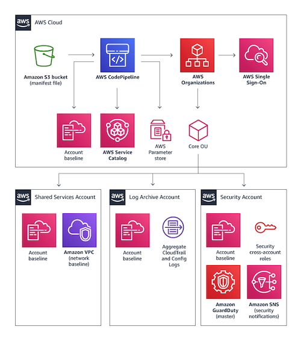
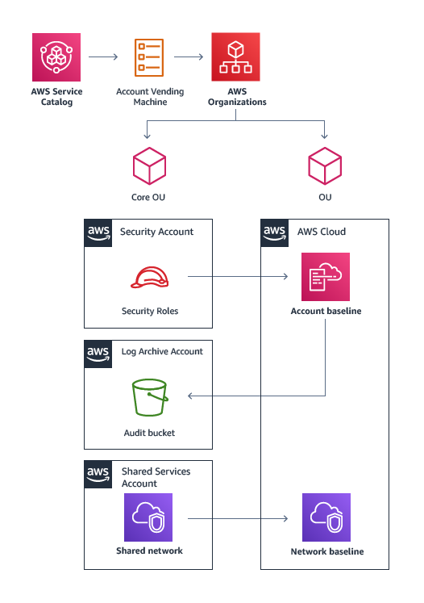
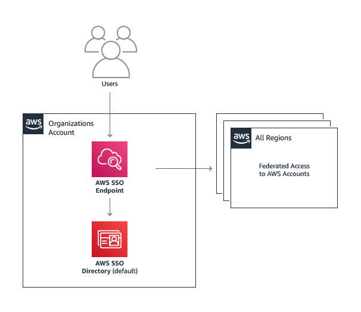
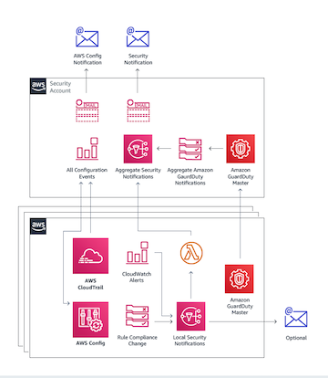

# terraform-aws-landing-zone
[AWS Landing Zone](https://aws.amazon.com/solutions/aws-landing-zone/) is
a solution that helps customers more quickly set up a secure, multi-account
AWS environment based on AWS best practices. This repository contains one
terraform module that dynamically deploys components of AWS Landing Zone
solution based on input list of `.tfvars` files.


## How Does This Module Work
Based on terraform's [standard module structure](
https://www.terraform.io/docs/modules/index.html#standard-module-structure)
guidelines, this repository contains the following folders:
* [root](tree/master) - module's standard terraform configuration
* [components](tree/master/components) - yaml-based and terraform compatible configurations
* [examples](tree/master/examples) - different ways to combine components as part of this module
* [modules](tree/master/modules) - standalone, reusable and production-ready module
* [tests](tree/master/tests) - set of automated tests to use in CI/CD pipelines

To get started, simply include `main.tf` into your codebase:
```hcl
module "sample" {
  source     = "TerraHubCorp/landing-zone/aws"
  version    = "0.0.1"
  root_path  = "${path.module}"
  account_id = "${var.account_id}"
  region     = "${var.region}"
  landing_zone_components = "${var.landing_zone_components}"
}
```
> NOTE: Make sure to include `variables.tf` and `outputs.tf` (whatever makes sense)


## What Components Are Available
AWS Landing Zone solution is defined by the following strategy:
1. [Multi-Account Structure](#multi-account-structure)
   * AWS Organization account
   * Shared Services account
   * Log Archive account
   * Security account
2. [Account Vending Machine](#account-vending-machine)
3. [User Access and Identity Management](#user-access-and-identity-management)
4. [Monitoring and Notifications](#monitoring-and-notifications)

### Multi-Account Structure
This terraform module at this point in time covers only Multi-Account Structure:


Based on above architecture, the list of available components is:
* Two Amazon S3 buckets for [manifest files](components/landing_zone_pipeline_s3_bucket/.terrahub.yml) and [artifacts](components/landing_zone_pipeline_artifact_s3_bucket/.terrahub.yml)
* AWS CodePipeline [configuration](components/landing_zone_code_pipeline/.terrahub.yml) for continuous delivery
* AWS CodeBuild [configuration](components/landing_zone_code_build/.terrahub.yml) for building artifacts
* AWS Organization [account](components/landing_zone_organization/.terrahub.yml) and [multi-accounts setup](components/landing_zone_organization_accounts/.terrahub.yml)

### Account Vending Machine

Coming soon...

### User Access and Identity Management

Coming soon...

### Monitoring and Notifications

Coming soon...
